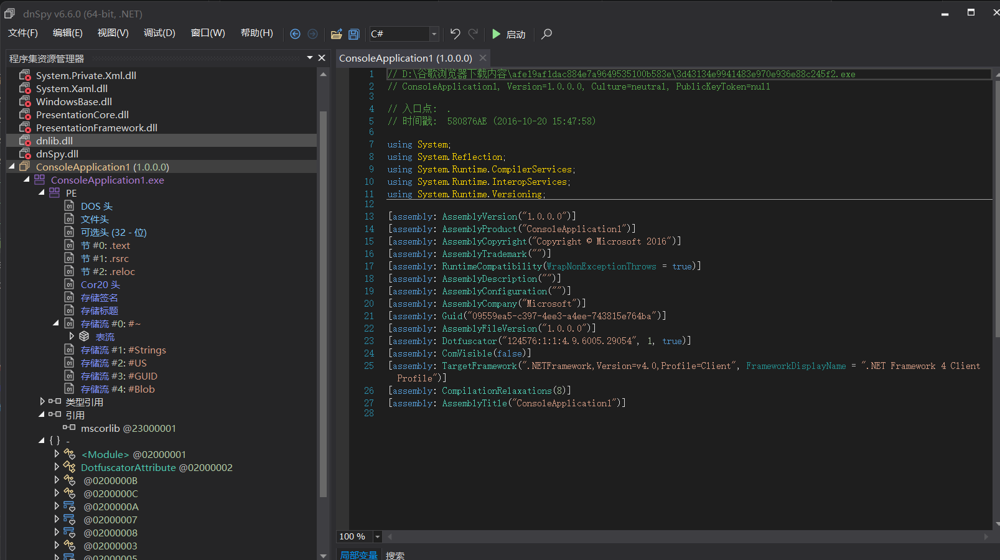
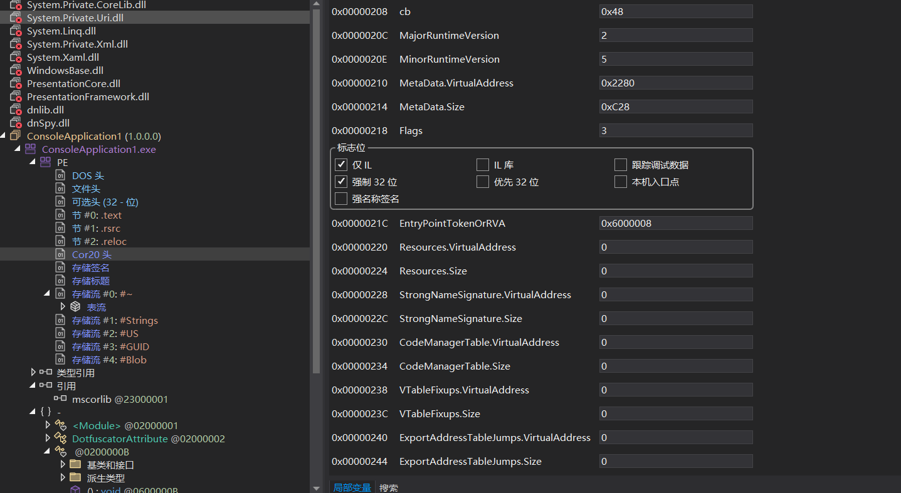
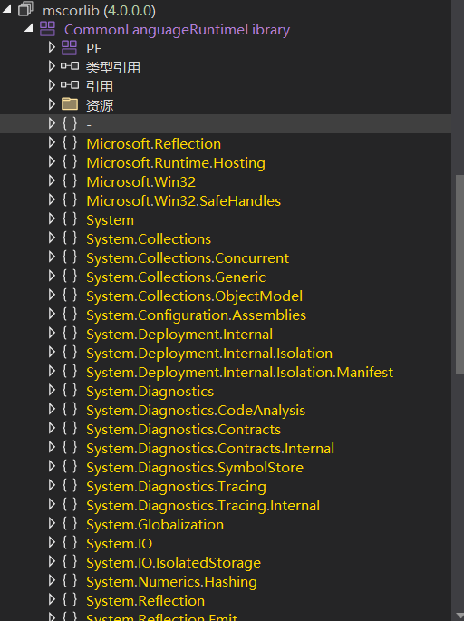
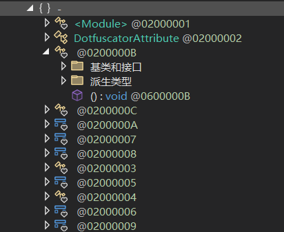
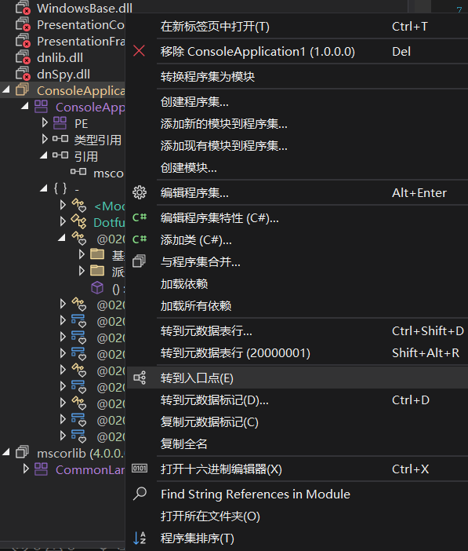
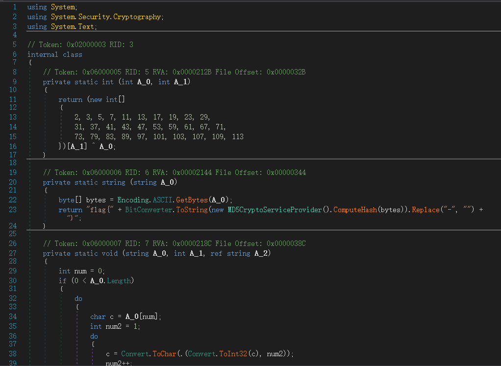
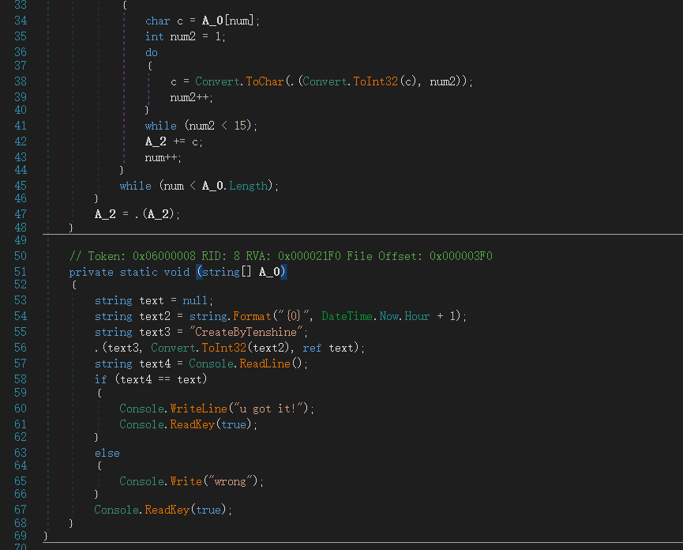

## .NET程序逆向与dnSPY初试

最近一直在学习二进制内容（其实玩大于学），主要在Reverse方向，也在攻防世界上找了些题做，但之前做的都是ELF文件或者PE文件题，这次遇到了.NET文件题，用IDA来分析很麻烦（至少我不会），所以下载了dnspy来做这题

### 初始界面



咋一看很唬人，其实一点也不简单



可以看到.NET文件特有的Cor20头的一些信息



这些黄色的英文是.NET框架的核心基础类库，全称是 Microsoft Common Object Runtime Library



而这个{}-的内容则是重中之重，它包含程序里面自己定义的函数，但是由于这个程序被Dotfuscator给混淆加密了，函数名看不出来，不然下面那些0200000C、0200000A都是可以看到函数名的



但dnSpy还是太牛逼了，直接右键就可以进入入口点

### 逆向过程



这就是这个.NET程序反汇编后的C#代码了，看起来比IDA反汇编好懂多了

整个程序的逻辑并不复杂

```//
private static int ᜀ(int A_0, int A_1)
{
    return (new int[] {
        2, 3, 5, 7, 11, 13, 17, 19, 23, 29,
        31, 37, 41, 43, 47, 53, 59, 61, 67, 71,
        73, 79, 83, 89, 97, 101, 103, 107, 109, 113
    })[A_1] ^ A_0;
}
```

用素数A_1对字符A_0做 XOR 变换

```
// Token: 0x06000006 RID: 6
private static string ᜀ(string A_0)
{
    byte[] bytes = Encoding.ASCII.GetBytes(A_0);           // 字符串转 ASCII 字节
    byte[] hash = new MD5CryptoServiceProvider().ComputeHash(bytes);  // 计算 MD5
    string md5 = BitConverter.ToString(hash).Replace("-", "");       // 转大写字符串
    return "flag{" + md5 + "}";                           // 包装成 flag{...}
}
```

对输入字符串计算 MD5，包装成 flag 格式

```
// Token: 0x06000007 RID: 7
private static void ᜀ(string A_0, int A_1, ref string A_2)
{
    int num = 0;
    if (0 < A_0.Length)           // 如果字符串非空
    {
        do
        {
            char c = A_0[num];    // 取第 num 个字符
            int num2 = 1;
            do
            {
                // 对字符进行 14 次 XOR 变换
                c = Convert.ToChar(ᜅ.ᜀ(Convert.ToInt32(c), num2));
                num2++;
            }
            while (num2 < 15);    // num2: 1→14
          
            A_2 += c;              // 追加到结果
            num++;
        }
        while (num < A_0.Length); // 遍历每个字符
    }
    A_2 = ᜅ.ᜀ(A_2);              // 调用方法2，生成 flag{MD5}
}
```

对每个字符异或14次素数，然后进行MD5计算并封装flag

```
// Token: 0x06000008 RID: 8
private static void ᜀ(string[] A_0)   // A_0 = 命令行参数（未使用）
{
    string text = null;                                    // 生成的密码
    string text2 = string.Format("{0}", DateTime.Now.Hour + 1);  // 当前小时+1
    string text3 = "CreateByTenshine";                     // 密钥
  
    // 调用方法3生成密码
    // 注意：Convert.ToInt32("24") = 24，但 A_1 未被使用！
    ᜅ.ᜀ(text3, Convert.ToInt32(text2), ref text);
  
    string text4 = Console.ReadLine();   // 读取用户输入
  
    if (text4 == text)                  // 比较
    {
        Console.WriteLine("u got it!");
    }
    else
    {
        Console.Write("wrong");
    }
}
```

这就是main函数了，text3是密钥，调用第三个方法得到flag，然后读取用户的输入，看是否等于flag，text2=DateTime.Now.Hour + 1的那个就是混淆的代码，压根没用

下面是解题脚本,运行后就可以得到flag了

```
import hashlib

source = "CreateByTenshine"

# 原程序中的连续异或等价于异或 0x18
transformed = "".join(chr(ord(c) ^ 0x18) for c in source)

digest = hashlib.md5(
    transformed.encode("ascii")
).hexdigest().upper()

flag = f"flag{{{digest}}}"

print("异或后的字符串:", transformed)
print("最终 flag:", flag)
```

flag{967DDDFBCD32C1F53527C221D9E40A0B}
