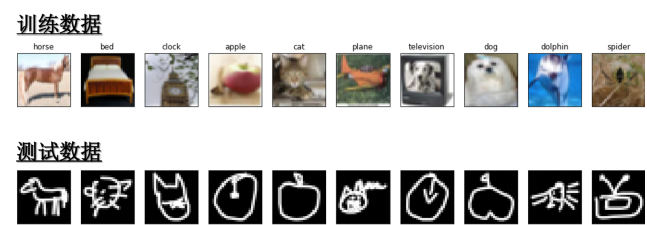

## 李宏毅机器学习课程总结一、二

由于学长分享的B站课程内容单看较为难懂，本人结合相关配套书籍（LeeDL Tutorial）与视频进行学习。

### 第一章：机器学习基础

机器学习的本质：寻找一个function，让输入映射到输出

第一章引出了几个概念：

- 回归（regression）:输出结果是一个或多个数字
- 特征（feature）:模型用来分析的数据属性，如预测房价时，楼层面积地段都属于feature
- 标签（label）:机器学习预测的真实答案，如房价=100万，100万就属于label
- 模型（model):机器学习学习出来的函数
- 参数（parameter):模型内部需要用到的数值
- 损失函数（loss）：将模型的误差进行量化的一个函数
- 梯度下降（gradient descend）：根据损失函数的斜率，不断调整参数，让损失越来越小，梯度可以理解成斜率
- 超参数（Hyperparameter):和参数是不同的概念，参数是模型自己学习来调整的，超参数是人为设定的，如学习率、Batch Size、训练轮数都是超参数

第一章内容主要涉及以上概念，其余内容均在后续的章节中体现

---

### 第二章：实践方法论

#### 模型偏差（Bias）

一个函数集合里的函数并不能拟合所需要的规律，就比如房价的公式是y=x^2,但如果函数集里只有y=b+wx，这就不能很好拟合出房价的规律，而这通常会呈现出训练集误差大，测试集误差也大的特征，欠拟合问题就是模型bias过高的一个情况

#### 优化问题（Optimization）

本质上是寻找一个最佳的参数的问题，常见的原因是学习率不合适和梯度问题，如果说一个模型很复杂，但误差很大，首先应该怀疑优化问题而不是模型问题

#### 过拟合问题（Overfitting）

过拟合问题，通常表现为训练集误差很小，但是测试集误差极大，通常原因为：训练数据少或者模型太复杂，例如：一个正常的模型经训练后能有效识别一个动物是不是猫，然而现在模型经训练后记住了训练集中每只猫的体型和毛发颜色，然后换只猫来测试，这个模型就识别不出了

解决思路：数据增强方案；给模型增加些限制

#### 交叉验证（Cross Validation）

如果你的数据很少，如果全拿来当训练集，肯定会出现过拟合情况，就比如10次作业，老师随机挑2次作业来进行考试，假如抽到2次简单的，学生考得好就说明成绩好吗，所以解决这个问题的最好方法就是10次作业，老师平均分成5份，轮流将5份作业用于考试，最后将5轮考试的成绩平均分算为真实成绩，这样每份作业都会被考到，学生每份都能做到，这种方法叫做k折交叉验证

#### 不匹配（Mismatch）

其实也算一种overfitting，但它的原因跟overfitting是不一样的，不匹配的原因是因为你的训练资料和测试资料的分布是不一样的，这两者不一样，训练资料再增加也无济于事

上图就是典型的训练数据和测试数据不等，也叫分布不同，导致不匹配
