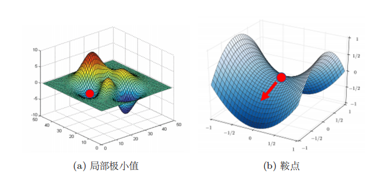
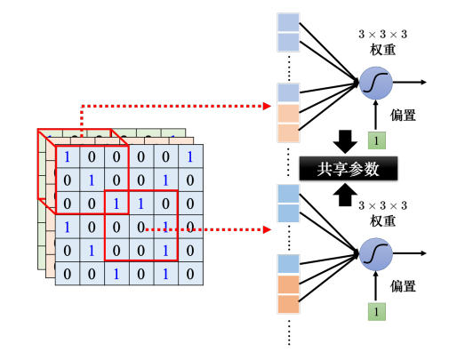
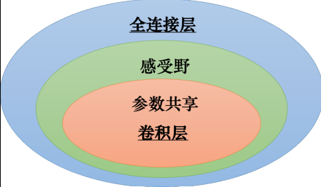

## 李宏毅机器学习课程总结三、四

前一二章为机器学习的基础和机器学习遇到的问题，从第三章开始就开始真正进入深度学习了

### 第三章：深度学习基础

#### 局部极小值与鞍点

局部极小值在本人理解中就是高等数学中函数在某区间中的极小值，我们希望找到损失函数最低点，最低点对应最优参数，然而我们担心使用梯度下降的方法时候掉入到局部最优点出不来，这个点就叫局部极小值

然而深度学习真正的大敌其实不是局部极小值，而是鞍点，模型不可能只工作在二维空间里，多数情况在三维空间中，当遇到鞍点时，在某个方向可能为局部极小值，但在另一个方向时，就可能是最大值了

#### 批量（Batch）和动量（Momentum）

##### 批量

当训练模型时，有两种极端方法，第一种全批量梯度下降，每次把全部数据都拿来计算，假设有100万张图片，每更新一次参数就要先算100万张图片，这几乎不能接受。第二种是随机梯度下降（SGD），每次只看一条数据，优点是速度快，缺点是噪声大，训练过程会很抖，现代深度学习标准就是两者折中，例如：Batch = 64就表示一次学习64条数据，Batch就是批量，Batch Size就是总数据量/Batch。与Batch经常一起出现的还有Epoch，例如：Epoch = 10表示整个训练集被学习10遍

##### 动量

梯度下降法的目标是寻找最低点，但当地形是是一个陡峭的V字形山谷时，训练轨迹会一直左右摇摆，现实中的球下山时候不会立刻停
因为有惯性，动量Momentum就模仿这个现象，更新参数时不仅看当前梯度，还看之前运动方向。引入动量后，每次在移动参数的时候，不是只往梯度的反方向来移动参数，而是根据梯度的反方向加上前一步移动的方向决定移动方向。

#### 自适应学习率

给每一个参数不同的学习率

AdaGrad（Adaptive Gradient）是典型的自适应学习率方法，其能够根据梯度大小自动调整学习率。AdaGrad 可以做到梯度比较大的时候，学习率就减小，梯度比较小的时候，学习率就放大。然而同一个参数的同个方向，学习率也是需要动态调整的，于是就有了一个新的方法———RMSprop，它是改进了 AdaGrad的方法。最常用的优化的策略或者优化器是Adam。Adam 可以看作 RMSprop 加上动量，其使用动量作为参数更新方向，并且能够自适应调整学习率。

#### 分类（Classification）

这个概念还是很好懂的，回归（regression）是输出一些数值，Classification就是对一些东西进行分类，比如模型输出房子的价格，这是回归，模型输出的是这张图片是猫还是狗，这就属于分类

##### Softmax

一个函数，比如神经网络输出：

<pre class="overflow-visible! px-0!" data-start="2105" data-end="2134">

<pre class="cm-content q9tKkq_readonly m-0"><code>猫：2.1 狗：5.3 鸟：0.7</code></pre>

</pre>

这不是概率。通过 Softmax函数就可以转换成：

<pre class="overflow-visible! px-0!" data-start="2157" data-end="2184">

<pre class="cm-content q9tKkq_readonly m-0"><code>猫：4% 狗：93% 鸟：3%</code></pre>

</pre>

这就变成了概率分布。

##### 交叉熵

这是分类最重要的损失函数。它衡量预测概率和真实概率差多少

#### 批量归一化（Batch Normalization）

> 如果误差表面很崎岖，它比较难训练。能不能直接改误差表面的地貌，“把山铲平”，让它
>
> 变得比较好训练呢？批量归一化（Batch Normalization，BN）就是其中一个“把山铲平”的
>
> 想法。

其实批量归一化可以理解成我们学习概率论的时候，对正态分布函数进行标准正态化的一个过程，训练过程中，由于每层输出分布不断变化，这就导致导致训练困难、收敛慢，通过批量归一化，可以把数据标准化，使得均值≈0、方差≈1，这样就可以训练更快、训练更稳定、允许更大学习率

---

### 第四章：卷积神经网络

这章是计算机视觉的基础

> 对于机器，图像可以描述为三维张量（张量可以想成维度大于 2 的矩阵）。一张图像是一个三维的张量，其中一维代表图像的
>
> 宽，另外一维代表图像的高，还有一维代表图像的通道（channel）的数目。

> Q：什么是通道？
>
> A：彩色图像的每个像素都可以描述为红色（red）、绿色（green）、蓝色（blue）的组
>
> 合，这 3 种颜色就称为图像的 3 个色彩通道。这种颜色描述方式称为 RGB 色彩模型，
>
> 常用于在屏幕上

#### 观察一：检测模式不需要整张图像

人在判断一个物体的时候，往往也是抓最重要的特征。看到这些特征以后，就会直觉地看到了某种物体。对于机器，也许这是一个有效的判断图像中物体的方法。但假设用神经元来判断某种模式是否出现，也许并不需要每个神经元都去看一张完整的图像。因为并不需要看整张完整的图像才能判断重要的模式（比如鸟嘴、眼睛、鸟爪）是否出现

#### 感受野（第一个简化神经网络的方式）

感受野（receptive field）可以理解为一个神经元能看到的区域。例如一张8×8的图片，某个神经元只看3×3的区域，这样就使得深度学习需要参数变少。感受野是可以有重叠的

#### 观察二：同样模式会出现在不同地方

比如两周图片都是鸟，但是鸟嘴出现在不同的位置

> 假设在某个感受野里面，有一个神经元的工作就是检测鸟嘴，鸟嘴就会被检测出来。所以就算鸟嘴出现在中间也没有关系。假设其中有一个神经元可以检测鸟嘴，鸟嘴出现在图像的中间也会被检测出来。但这些检测鸟嘴的神经元做的事情是一样的，只是它们守备的范围不一样。既然如此，其实没必要每个守备范围都去放一个检测鸟嘴的神经元。如果不同的守备范围都要有一个检测鸟嘴的神经元，参数量会太多了，因此需要做出相应的简化。

#### 共享参数parameter sharing（第二个简化的方式）

如上图，两个神经元的权重完全是一样的，但他们的输出不会一样，因为两个神经元的感受野是不一样的，即输入不一样，即使参数一样，但输出仍然不一样。

#### 对于简化1和简化2的总结

> 全连接网络是弹性最大的。全连接网络可以决定它看整张图像还是只看一个范围，如果它只想看一个范围，可以把很多权重设成 0。全连接层（fully-connected layer，）可以自己决定看整张图像还是一个小范围。但加上感受野的概念以后，只能看一个小范围，网络的弹性是变小的。参数共享又进一步限制了网络的弹性。本来在学习的时候，每个神经元可以各自有不同的参数，它们可以学出相同的参数，也可以有不一样的参数。但是加入参数共享以后，某一些神经元无论如何参数都要一模一样的，这又增加了对神经元的限制。而感受野加上参数共享就是卷积层（convolutional layer），用到卷积层的网络就叫卷积神经网络。卷积神经网络的偏差比较大。但模型偏差大不一定是坏事，因为当模型偏差大，模型的灵活性较低时，比较不容易过拟合。全连接层可以做各式各样的事情，它可以有各式各样的变化，但它可能没有办法在任何特定的任务上做好。而卷积层是专门为图像设计的，感受野、参数共享都是为图像设计的。虽然卷积神经网络模型偏差很大，但用在图像上不是问题。如果把它用在图像之外的任务，就要仔细想想这些任务有没有图像用的特性。

其实CNN的核心理念就是两个，感受野和参数共享，尤其是参数共享，这是CNN真正比普通的神经网络优秀的地方，感受野使得CNN只需要识别一些特定区域，参数共享使得CNN大幅减少了参数量。

总结一句话：CNN 通过“局部连接（感受野）”和“参数共享（卷积核）”，利用图像的空间结构，大幅减少参数量，同时保留重要特征。

#### 观察三：缩小图片不影响识别

把一张大图片变成原来的1/n，不会影响机器的识别

#### 汇聚Pooling（第三个简化的方式）

核心思想：保留重要特征，压缩数据规模

假设图片里有一只猫，猫耳朵在左边，就算稍微移动一些距离，你还是知道这是猫耳朵，也就是说特征出现的位置稍微变化，不应该影响识别结果。.

> 不过汇聚对于模型的性能（performance）可能会带来一点伤害。假设要检测的是非常微细的东西，随便做下采样，性能可能会稍微差一点。
>
> 所以近年来图像的网络的设计往往也开始把汇聚丢掉，它会做这种全卷积的神经网络，整个网络里面都是卷积，完全都不用汇聚。汇聚最主要的作用是减少运算量，通过下采样把图像变小，从而减少运算量。随着近年来运算能力越来越强，如果运算资源足够支撑不做汇聚，很多网络的架构的设计往往就不做汇聚，而是使用全卷积，卷积从头到尾，看看做不做得起来，看看能不能做得更好。一般架构就是卷积加汇聚，汇聚是可有可无的，很多人可能会选择不用汇聚。

#### 卷积神经网络的应用：下围棋

CNN明明是处理图片的，为什么还能下围棋呢？因为棋盘本质上也是图片，一张19×19的图片。
